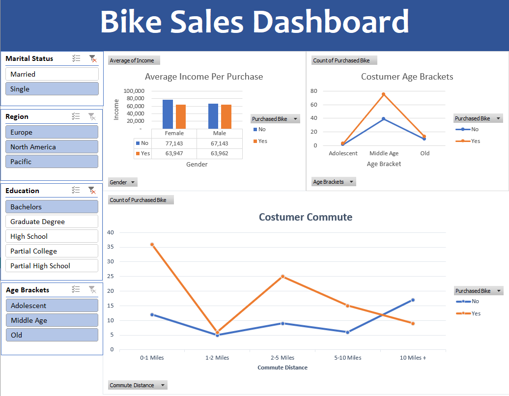
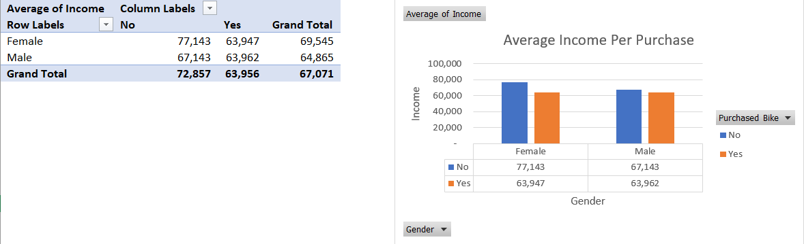
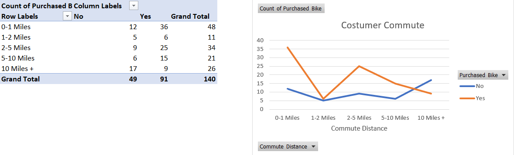

# Bike Sales Dashboard – Excel Data Analysis Project

## 📌 Project Overview
This project analyzes a bike sales dataset using **Microsoft Excel** to uncover customer purchasing patterns.  
The analysis is built using **Pivot Tables, Pivot Charts, and an interactive dashboard** to convert raw data into business-ready insights.

The objective was to demonstrate **end-to-end Excel data analysis**, from dataset exploration to insight-driven visualization.

---

## 📂 Dataset Description
The dataset contains customer demographic and behavioral attributes, including:

- Gender  
- Age & Age Brackets  
- Marital Status  
- Education Level  
- Region  
- Income  
- Commute Distance  
- Bike Purchase Status (Yes / No)

The raw dataset is included in the repository for reproducibility.

---

## 🛠 Tools & Skills Used
- Microsoft Excel  
- Pivot Tables  
- Pivot Charts  
- Slicers & Filters  
- Dashboard Design  
- Data Categorization (Age Brackets, Commute Distance Buckets)

---

## 📊 Key Analysis & Insights

### 1️⃣ Income vs Bike Purchase
- Customers who **did not purchase bikes** have a higher average income than buyers.
- Indicates that bike purchases are driven more by **lifestyle and commute needs** than income alone.

### 2️⃣ Age Bracket Analysis
- **Middle-aged customers** represent the largest segment of bike buyers.
- Adolescents and older age groups show significantly lower purchase counts.
- This group is the **primary target demographic**.

### 3️⃣ Commute Distance Impact
- Customers commuting **0–5 miles** are most likely to purchase bikes.
- Purchase likelihood declines as commute distance increases beyond 5 miles.

### 4️⃣ Demographic Segmentation
The dashboard allows dynamic filtering by:
- Marital Status
- Region
- Education Level
- Age Bracket

This enables fast, scenario-based customer analysis.

---

## 📈 Dashboard Features
- One-page interactive Excel dashboard
- Multiple linked pivot charts
- Slicers for real-time filtering
- Clean, business-focused layout

---

## 📸 Dashboard Preview

### Pivot Table Analysis

---

---

---

## 👤 Author
**Shruti Singh** 
- GitHub: https://github.com/Shrutiji007  
- LinkedIn: https://www.linkedin.com/in/shruti-singh-7a599030b
